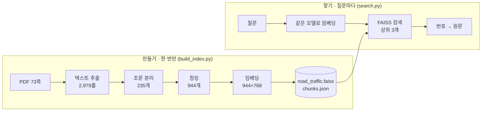

# 개발 과정: 구상부터 결과까지

도로교통법 PDF를 FAISS 벡터DB에 넣고 검색해 보기까지, 어떤 순서로 생각하고 만들고 고쳤는지 정리한 기록입니다.
최종 결과와 실행 방법은 [README](../README.md), 제출용 보고서는 [PDF](../보고서_FAISS_벡터DB_파일검색.pdf)에 있습니다.

## 한눈에 보기

| 단계 | 한 일 | 결과물 |
|---|---|---|
| 1. 구상 | 목표와 성공 기준 정하기, 문서·도구 고르기 | 평가 질문 10개와 정답 조문 |
| 2. 사전 실험 | 숫자 2개짜리 벡터, 문장 5개로 원리 확인 | "의미 검색이 된다"는 확인 |
| 3. 설계 | 처리 흐름과 주요 결정 정리 | 파이프라인 6단계 |
| 4. 구현 | 추출 → 분리 → 청킹 → 임베딩 → 저장 → 검색 | `build_index.py`, `search.py` |
| 5. 평가 | 질문 10개 채점 | Hit@1 8/10, Hit@3 10/10 |
| 6. 재검토 | 결과를 문단 단위로 다시 확인 | 채점 기준의 한계 발견 |

---

## 1. 구상

### 목표

PDF 문서 하나를 벡터DB에 넣고, 자연어 질문으로 검색했을 때 결과가 어떻게 나오는지 직접 확인한다.

### 문서 고르기: 도로교통법

| 고려한 점 | 도로교통법이 맞는 이유 |
|---|---|
| 나누기 쉬운가 | 모든 조문이 `제N조(제목)`으로 시작해서 의미 단위로 자르기 좋다 |
| 채점하기 쉬운가 | 정답을 조문 번호로 정할 수 있다 |
| 의미 검색을 시험할 수 있는가 | 사람은 "휴대폰", "헬멧"이라고 묻고 법은 "휴대용 전화", "인명보호 장구"라고 쓴다 |
| 질문을 만들기 쉬운가 | 음주운전, 주차, 면허처럼 누구나 아는 주제다 |

### 도구 고르기

| 역할 | 선택 | 고른 이유 | 고려한 다른 선택지 |
|---|---|---|---|
| 벡터DB | FAISS (`faiss-cpu`) | `pip`로 설치, 서버 없이 파일 하나로 저장 | Chroma, Pinecone (서버나 계정이 필요) |
| 임베딩 | `jhgan/ko-sroberta-multitask` | 무료, 내 컴퓨터에서 실행, 한국어 문장 유사도로 학습됨 | OpenAI 임베딩 (유료 API) |
| PDF 추출 | `pdfplumber` | 한글 PDF에서 줄 단위로 안정적으로 추출 | `pypdf` |

### 성공 기준을 먼저 정하기

결과를 보고 나서 기준을 정하면 결과에 맞춰 기준을 고르게 된다. 그래서 **만들기 전에** 질문 10개와 정답 조문을 먼저 적었다.

- 다른 단어로 묻는 질문 3개: 휴대폰, 헬멧, 갓길
- 숫자를 묻는 질문 1개: 혈중알코올농도 기준
- 일반 질문 6개
- 지표: **Hit@1**(정답이 1위인 비율), **Hit@3**(정답이 3위 안에 든 비율)

---

## 2. 사전 실험: 원리부터 확인

본 작업 전에, 벡터 검색이 정말 "뜻"으로 찾는지 작은 예제로 먼저 확인했다.

### 실험 ① 숫자 2개짜리 장난감 벡터

문장마다 "운전 이야기 정도", "어린이 이야기 정도" 두 점수를 매긴다고 가정했다.

| 문장 | 벡터 |
|---|---|
| A 운전 중에 휴대폰을 쓰면 안 된다 | [0.9, 0.1] |
| B 휴대용 전화를 사용하지 아니할 것 | [0.8, 0.2] |
| C 어린이 보호구역을 지정한다 | [0.1, 0.9] |

```
내적        A·B = 0.74      A·C = 0.18
코사인      A·B = 0.991     A·C = 0.220   (길이를 1로 맞춘 뒤 내적)
```

**알게 된 것:** 뜻이 비슷하면 방향이 비슷하다. 길이를 1로 맞추면(정규화) 내적이 곧 코사인 유사도가 된다.
→ 실제 구현에서 `normalize_embeddings=True`와 `IndexFlatIP`(내적)를 함께 쓰기로 했다.

### 실험 ② 진짜 모델로 문장 5개 검색

법조문을 흉내 낸 문장 5개와 질문 "운전하면서 핸드폰 봐도 돼?"로 직접 계산했다.

```
0.499  운전자는 운전 중에 휴대용 전화를 사용하지 아니할 것   ← 1위
0.367  누구든지 술에 취한 상태에서 자동차를 운전하여서는 …
0.322  자동차의 운전자는 고속도로에서 갓길로 통행하여서는 …
0.218  어린이 보호구역에서는 자동차의 통행속도를 …
0.174  교통사고가 난 경우 운전자는 즉시 정차하여 …
```

같은 데이터를 FAISS `IndexFlatIP`에 넣어 검색해도 점수와 순서가 똑같이 나왔다(`[[0.499 0.367 0.322]] [[0 1 3]]`).

**알게 된 것**
- 겹치는 단어가 하나도 없어도("핸드폰" ↔ "휴대용 전화") 1위로 찾는다.
- 이 규모에서 FAISS가 하는 일은 `행렬 @ 질문벡터` + 정렬 + 저장이다. 문서가 많아지면 인덱스 종류만 바꿔 확장할 수 있다.

---

## 3. 설계



만들기와 찾기를 나눈 이유는 임베딩이 가장 오래 걸리기 때문이다(944개에 약 100초). 한 번 만들어 파일로 저장해 두면, 검색할 때는 불러오기만 하면 된다.

### 주요 설계 결정

| 결정 | 선택 | 이유 |
|---|---|---|
| 자르는 기준 | 조문 → 줄 단위 | 글자 수로 자르면 두 조문이 한 조각에 섞인다 |
| 청크 크기 | 180자 | 모델이 128토큰(한글 약 210자)까지만 읽는다 (4장 참고) |
| 조각마다 이름표 | `[제N조(제목)]`을 앞에 붙임 | 잘린 조각만 봐도 어느 조문인지 알 수 있게 |
| 유사도 | 코사인 (정규화 + 내적) | 사전 실험 ①의 결론 |
| 인덱스 | `IndexFlatIP` (전부 비교) | 944개는 전부 비교해도 47ms. 근사 인덱스는 정확도만 잃는다 |
| 벡터와 원문 저장 | `.faiss` + `chunks.json`을 같은 순서로 | FAISS는 숫자만 저장한다. 결과 번호로 원문을 찾으려면 순서가 같아야 한다 |

---

## 4. 구현

### 4-1. 텍스트 추출

- `pdfplumber`로 73쪽에서 줄 단위로 추출했다.
- 모든 쪽에 반복되는 머리말(`도로교통법`)과 꼬리말(`법제처 N 국가법령정보센터`) **147줄을 정규식으로 제거**하고 2,979줄이 남았다.
- 쪽번호를 함께 저장했다. 검색 결과를 PDF 원문과 대조할 때 쓴다.

### 4-2. 조문 분리

```python
ARTICLE_START = re.compile(r"^(제\d+조(?:의\d+)?)\(([^)]+)\)")   # 제N조(제목), 제N조의M(제목)
```

조문 235개가 나왔다. 본문은 제166조까지인데 개수가 더 많아서 원인을 확인했다.

| 발견 | 처리 |
|---|---|
| `제5조의2`처럼 중간에 끼워 넣은 조문 | 정상. 정규식에 `(?:의\d+)?` 포함 |
| 같은 조문이 현행판과 시행 예정판(`[시행일 : 2019. 6. 13.]`)으로 두 번 실림 | 이번에는 그대로 둠 → 한계로 기록 |
| 부칙에 `제1조`~`제4조`가 다시 나옴 | 쪽번호로 구분 가능 |
| 장 제목(`제2장 보행자의 통행방법`)이 앞 조문 끝에 붙음 | 장 제목 정규식을 따로 만들어 제외 |

### 4-3. 청킹: 처음 버전의 문제와 수정

**처음 버전 (800자 단위, 청크 296개)**

긴 조문을 800자씩 나눴다. 인덱스까지 만든 뒤 모델 설정을 확인하다가 문제를 발견했다.

```python
model.max_seq_length                         # 128
len(model.tokenizer(text)["input_ids"])      # 159자 → 95토큰 (글자당 약 0.6토큰)
```

128토큰 ÷ 0.6 ≈ 210자. **800자 청크는 앞 210자 정도만 임베딩에 반영되고 나머지는 버려지고 있었다.** 800자 청크를 실제로 세어 보니 422~496토큰이었다.

**수정 버전 (180자 단위, 청크 944개)**

- 줄 단위로 담다가 180자를 넘으면 새 조각을 시작한다. 문장 중간에서 자르지 않기 위해서다.
- 두 번째 조각부터 `[제N조(제목)]` 이름표를 붙인다.
- 결과: 944개 중 942개가 128토큰 이내, 2개만 136토큰으로 조금 넘는다.

### 4-4. 임베딩과 저장

```python
emb = model.encode(texts, batch_size=32, normalize_embeddings=True).astype("float32")
index = faiss.IndexFlatIP(emb.shape[1])
index.add(emb)
faiss.write_index(index, "index/road_traffic.faiss")
```

| 항목 | 값 |
|---|---|
| 벡터 | 944 × 768 |
| 인덱스 파일 | 2.8MB |
| 임베딩 시간 | 약 100초 (CPU) |
| 모델·인덱스 불러오기 | 약 3.9초 |
| 질문 1개 검색 | 약 47ms |

### 4-5. 검색

질문도 **같은 모델, 같은 정규화**로 바꿔야 같은 공간에서 비교할 수 있다. 모델을 매번 불러오지 않도록 `Searcher` 클래스로 묶었다.

```python
def search(self, query, k=3):
    q = self.model.encode([query], normalize_embeddings=True).astype("float32")
    scores, ids = self.index.search(q, k)
    return [{**self.chunks[i], "score": float(s)} for s, i in zip(scores[0], ids[0])]
```

---

## 5. 평가

| # | 질문 | 정답 | 1위 결과 | 정답 순위 |
|---|---|---|---|---|
| 1 | 음주운전으로 보는 혈중알코올농도 기준은? | 제44조 | 제93조 | 3 |
| 2 | 술 마시고 운전하면 어떤 처벌을 받나요? | 제148조의2 | 제148조의2 | 1 |
| 3 | 어린이 보호구역에서 지켜야 할 것 | 제12조 | 제12조 | 1 |
| 4 | 운전 중에 휴대폰 사용해도 되나요? | 제49조 | 제49조 | 1 |
| 5 | 고속도로에서 갓길로 달려도 되나요? | 제60조 | 제60조 | 1 |
| 6 | 교통사고를 내면 운전자가 해야 할 조치 | 제54조 | 제29조 | 3 |
| 7 | 운전면허가 취소되는 경우 | 제93조 | 제93조 | 1 |
| 8 | 자전거 탈 때 헬멧을 써야 하나요? | 제50조 | 제50조 | 1 |
| 9 | 주차가 금지된 장소는 어디인가? | 제33조 | 제33조 | 1 |
| 10 | 긴급자동차에게 길을 양보해야 하는 의무 | 제29조 | 제29조 | 1 |

**Hit@1 = 8/10, Hit@3 = 10/10.** 질문별 상위 3개 원문은 [results.md](../results.md)에 있다.

### 틀린 2건

| 질문 | 1~3위 점수 | 분석 |
|---|---|---|
| Q1 혈중알코올농도 | 0.6125 / 0.6112 / 0.6106 | 면허 취소(제93조)와 벌칙(제148조의2)도 "제44조 위반", "술에 취한 상태"를 반복한다. 숫자 "0.05"는 의미 검색에서 잘 반영되지 않는다 |
| Q6 사고 후 조치 | 0.7284 / 0.7229 / 0.7199 | "운전자는 ~하여야 한다"는 의무 문장이 비슷한 조문이 위로 올라왔다. 정답과 1위의 차이는 0.009점 |

---

## 6. 재검토: 채점 기준의 한계 발견

보고서를 쓰면서 결과를 **조문 번호가 아니라 문단 단위**로 다시 확인했다. 그 결과 맞았다고 채점한 Q8에서 문제가 나왔다.

| 순위 | 조문 | 실제로 나온 문단 | 헬멧 내용 |
|---|---|---|---|
| 1 | 제50조 | ⑧ 약물 영향 운전 금지, ⑨ 야간 전조등 | 없음 |
| 2 | 제15조의2 | 자전거횡단도 | 없음 |
| 3 | 제50조 | ③ 끝부분(동승자 착용) / ④ 자전거 운전자는 … 인명보호 | 있음 |

- 조문 번호로만 채점하면 1위 정답이지만, **실제로 헬멧 문장이 든 청크는 3위**였다.
- 그 문장도 청크 경계에서 `… 인명보호` / `장구를 착용하여야 …`로 둘로 잘려 있었다.

**배운 것:** 채점 단위가 크면 결과가 실제보다 좋아 보인다. 다음 평가에서는 문단 단위로 정답을 정해야 한다. 이 발견에 맞춰 README의 "잘 된 사례" 설명도 고쳤다.

---

## 7. 시행착오 모음

| 문제 | 발견한 계기 | 해결 |
|---|---|---|
| 800자 청크의 뒷부분이 임베딩에 반영되지 않음 | 모델의 `max_seq_length`(128) 확인 | 180자로 줄이고 이름표 추가 (296 → 944개) |
| 잘린 조각만으로는 어느 조문인지 모름 | 청크 내용을 직접 열어 봄 | 모든 조각 앞에 `[제N조(제목)]` |
| 장 제목이 조문 본문에 섞임 | 조문 텍스트 끝을 확인 | 장 제목 정규식으로 제외 |
| 터미널 한글 깨짐 | 실행 결과 출력 | `PYTHONIOENCODING=utf-8` 또는 `python -X utf8` |
| 같은 조문 청크가 2개씩 있음 | 제44조 청크 검색 | 원인(현행판·시행 예정판 중복) 기록, 다음 단계에서 처리 |
| 조문 단위 채점이 결과를 부풀림 | 문단 단위 재검토 | 6장 참고, 한계로 기록 |

---

## 8. 회고와 다음 단계

### 잘 된 것

- 사전 실험으로 원리를 먼저 확인해서, 정규화·내적·인덱스 종류를 이유를 갖고 정할 수 있었다.
- 성공 기준을 먼저 정해서 결과를 숫자로 말할 수 있었다.
- 청크 크기 문제를 실제 수치(128토큰, 422~496토큰)로 확인하고 고쳤다.

### 아쉬운 것

- 숫자나 정확한 용어를 묻는 질문에 약하다.
- 비슷한 조문 사이 점수 차이가 0.01 미만이라 순위가 쉽게 뒤바뀐다.
- 평가 질문이 10개라 한 문제가 10%p를 차지한다.

### 다음 단계

| 할 일 | 해결하려는 문제 |
|---|---|
| BM25 키워드 검색과 섞는 하이브리드 검색 | 숫자·용어 질문 |
| 상위 20개를 Cross-Encoder로 다시 정렬(리랭커) | 비슷한 조문 구별 |
| ①②③ 항 단위 청킹 + 앞뒤 겹치기(overlap) | 문장이 청크 경계에서 잘림 |
| `[시행일 : …]` 표시로 한 판만 남기기 | 중복 청크 |
| 질문 50개 이상, 문단 단위 정답 | 평가 신뢰도 |
